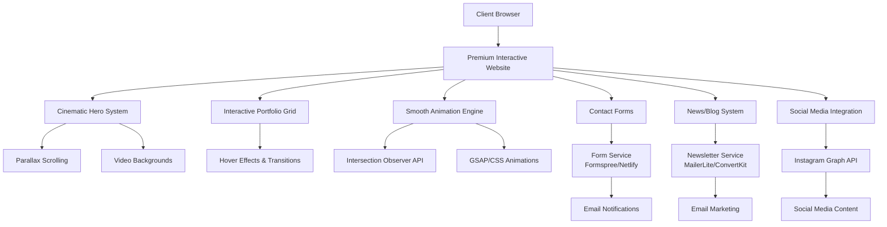

# Design Document

## Overview

This design document outlines the technical architecture and implementation approach for enhancing the Valhalla Tattoo website. The design focuses on creating a beautiful, fast, and simple website that generates quality leads while maintaining the existing aesthetic and preparing for future upgrades.

The approach emphasizes:
- **Simplicity**: Clean, maintainable code that's easy to enhance
- **Performance**: Fast loading times and smooth interactions
- **Visual Impact**: Professional design that impresses visitors
- **Mobile-First**: Responsive design that works perfectly on all devices
- **SEO-Friendly**: Optimized for search engines and local discovery

## Architecture

### High-Level Architecture



### Technology Stack

**Frontend:**
- **HTML5**: Semantic markup with proper SEO structure
- **CSS3**: Advanced styling with CSS Grid, Flexbox, custom properties, and CSS animations
- **Vanilla JavaScript**: Modern ES6+ with Intersection Observer API, smooth scrolling, and animation libraries
- **Animation Libraries**: GSAP (GreenSock) for premium animations and micro-interactions
- **Progressive Enhancement**: Works without JavaScript, enhanced with smooth animations

**Services & APIs:**
- **Form Handling**: Formspree or Netlify Forms for contact submissions
- **Email Marketing**: MailerLite or ConvertKit for newsletter management
- **Social Media**: Instagram Graph API for content import
- **Hosting**: Static hosting (Netlify, Vercel, or similar)

**Performance & SEO:**
- **Image Optimization**: WebP format with fallbacks, lazy loading
- **Caching**: Service worker for offline functionality
- **SEO**: Structured data, meta tags, semantic HTML
- **Analytics**: Google Analytics 4 for tracking

## Components and Interfaces

### 1. Portfolio System

**Component Structure:**
```
portfolio/
├── artist-gallery.js          # Main portfolio display logic
├── lightbox.js               # Image viewing functionality
├── portfolio-data.js         # Artist and image data management
└── social-integration.js     # Instagram content import
```

**Key Features:**
- Responsive image grid with masonry layout
- Lightbox with keyboard navigation and touch gestures
- Lazy loading for performance
- Fallback content for artists with limited portfolios
- Integration with social media posts

**Data Structure:**
```javascript
const artistData = {
  slug: 'artist-name',
  name: 'Artist Name',
  specialty: 'Tattoo Style',
  experience: 'Years of Experience',
  bio: 'Artist biography',
  socialMedia: {
    instagram: '@username',
    facebook: 'page-name'
  },
  portfolio: [
    {
      id: 1,
      filename: 'image.jpg',
      title: 'Tattoo Title',
      style: 'Traditional',
      placement: 'Arm',
      description: 'Description'
    }
  ]
}
```

### 2. Contact System

**Component Structure:**
```
contact/
├── contact-form.js           # Form handling and validation
├── form-routing.js          # Artist pre-selection logic
└── confirmation.js          # Success/error messaging
```

**Form Implementation:**
- Uses Formspree or Netlify Forms for backend-free operation
- Client-side validation with server-side backup
- Artist pre-selection from portfolio pages
- File upload support for reference images
- Spam protection with honeypot fields

**Form Fields:**
```html
<form action="https://formspree.io/f/YOUR_ID" method="POST">
  <input type="text" name="name" required>
  <input type="email" name="email" required>
  <select name="artist">
    <option value="general">General Inquiry</option>
    <option value="pagan">Pagan</option>
    <!-- Other artists -->
  </select>
  <textarea name="message" required></textarea>
  <input type="file" name="reference" accept="image/*">
  <input type="hidden" name="_subject" value="New Tattoo Inquiry">
</form>
```

### 3. News & Newsletter System

**Component Structure:**
```
news/
├── blog-manager.js          # Content management and display
├── newsletter.js           # Email signup handling
└── content-data.js         # Blog posts and news data
```

**Content Management:**
- Static JSON-based content system for simplicity
- Chronological display with pagination
- Category filtering (Studio News, Artist Updates, etc.)
- Integrated newsletter signup forms
- Social sharing buttons

**Newsletter Integration:**
```javascript
const newsletterSignup = {
  service: 'mailerlite', // or 'convertkit'
  apiEndpoint: 'https://api.mailerlite.com/api/v2/subscribers',
  listId: 'your-list-id',
  fields: ['email', 'name', 'source']
}
```

### 4. Social Media Integration

**Component Structure:**
```
social/
├── instagram-feed.js        # Instagram Graph API integration
├── social-display.js       # Social content rendering
└── fallback-handler.js     # Graceful degradation
```

**Instagram Integration:**
- Uses Instagram Graph API for official content access
- Caches content locally to reduce API calls
- Automatic content refresh on schedule
- Fallback to manual content when API unavailable
- Attribution and linking to original posts

**API Implementation:**
```javascript
const instagramConfig = {
  accessToken: 'YOUR_ACCESS_TOKEN',
  userId: 'YOUR_USER_ID',
  fields: 'id,caption,media_type,media_url,permalink,timestamp',
  limit: 12
}
```

### 5. SEO & Performance System

**SEO Components:**
```
seo/
├── meta-manager.js          # Dynamic meta tag generation
├── structured-data.js       # Schema.org markup
└── sitemap-generator.js     # XML sitemap creation
```

**Structured Data Schema:**
```json
{
  "@context": "https://schema.org",
  "@type": "LocalBusiness",
  "name": "Valhalla Tattoo",
  "description": "Professional tattoo studio in Spring Hill, TN",
  "address": {
    "@type": "PostalAddress",
    "streetAddress": "404 Mclemore Ave. Suite 4",
    "addressLocality": "Spring Hill",
    "addressRegion": "TN",
    "postalCode": "37174"
  },
  "telephone": "931-451-5313",
  "url": "https://valhallatattoo.com"
}
```

**Performance Optimizations:**
- Critical CSS inlined in HTML head
- Non-critical CSS loaded asynchronously
- JavaScript modules loaded with defer/async
- Image optimization with WebP and lazy loading
- Service worker for caching and offline functionality

## Data Models

### Artist Profile Model
```javascript
{
  id: String,
  slug: String,
  name: String,
  specialty: String,
  experience: String,
  bio: String,
  extendedBio: String,
  socialMedia: {
    instagram: String,
    facebook: String
  },
  portfolio: [PortfolioImage],
  seoData: {
    title: String,
    description: String,
    keywords: [String]
  }
}
```

### Portfolio Image Model
```javascript
{
  id: Number,
  filename: String,
  title: String,
  style: String,
  placement: String,
  sessionTime: String,
  description: String,
  tags: [String],
  isHealed: Boolean,
  uploadDate: Date
}
```

### Blog Post Model
```javascript
{
  id: Number,
  title: String,
  date: String,
  category: String,
  excerpt: String,
  content: String,
  tags: [String],
  featured: Boolean,
  author: String,
  image: String
}
```

### Contact Inquiry Model
```javascript
{
  name: String,
  email: String,
  phone: String,
  artist: String,
  message: String,
  referenceImages: [File],
  source: String,
  timestamp: Date
}
```

## Error Handling

### Client-Side Error Handling
- Form validation with user-friendly error messages
- Graceful degradation when JavaScript is disabled
- Fallback content when APIs are unavailable
- Loading states and error boundaries for async operations

### API Error Handling
- Retry logic for failed API calls
- Cached content fallbacks for social media
- Error logging for debugging
- User-friendly error messages

### Performance Error Handling
- Image loading fallbacks (WebP → JPEG → placeholder)
- Service worker error handling
- Network timeout handling
- Progressive enhancement approach

## Testing Strategy

### Manual Testing Checklist
- **Cross-browser compatibility**: Chrome, Firefox, Safari, Edge
- **Device testing**: Desktop, tablet, mobile (iOS/Android)
- **Form functionality**: All contact forms and newsletter signup
- **Performance**: Page load times under 3 seconds
- **SEO**: Meta tags, structured data, sitemap

### Automated Testing
- **Lighthouse audits**: Performance, SEO, Accessibility scores
- **Form testing**: Automated submission testing
- **Link checking**: Verify all internal and external links
- **Image optimization**: Verify WebP delivery and lazy loading

### User Acceptance Testing
- **Portfolio browsing**: Smooth navigation and image viewing
- **Contact forms**: Easy submission and confirmation
- **Mobile experience**: Touch-friendly interactions
- **Social media**: Proper content display and linking
- **Newsletter signup**: Successful subscription flow

## Implementation Phases

### Phase 1: Foundation (Week 1-2)
1. Set up project structure and build process
2. Implement responsive design system and CSS architecture
3. Create basic HTML structure with semantic markup
4. Set up form handling with Formspree/Netlify Forms

### Phase 2: Core Features (Week 3-4)
1. Implement portfolio system with lightbox functionality
2. Create news/blog system with content management
3. Set up newsletter integration
4. Implement basic SEO optimizations

### Phase 3: Enhancement (Week 5-6)
1. Add Instagram API integration
2. Implement performance optimizations
3. Add advanced SEO features and structured data
4. Create service worker for offline functionality

### Phase 4: Polish & Launch (Week 7-8)
1. Cross-browser testing and bug fixes
2. Performance optimization and Lighthouse audits
3. Content migration and final testing
4. Launch and monitoring setup

This design provides a solid foundation for the current requirements while maintaining flexibility for future enhancements. The modular architecture allows for easy addition of advanced features like real-time booking, client portals, and payment processing in Phase Two.